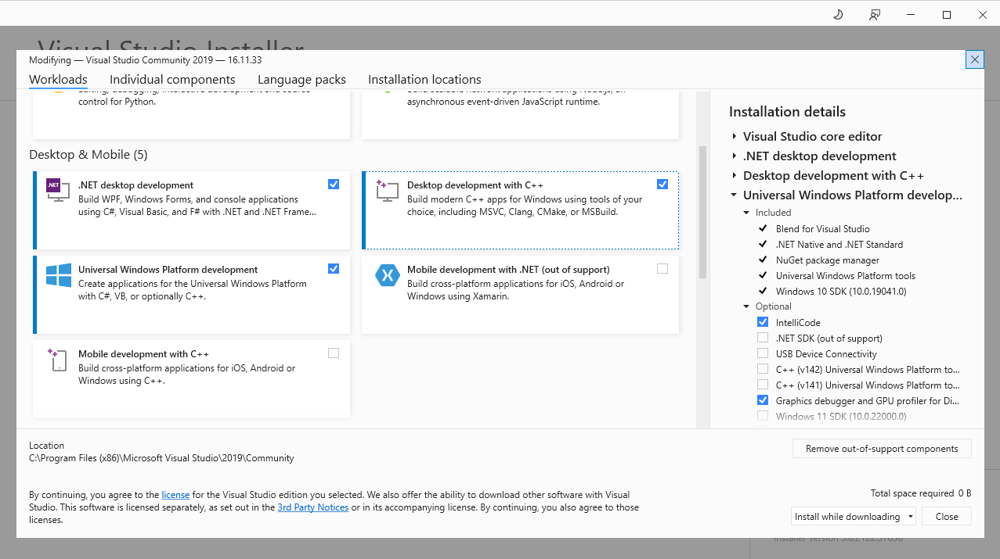

## Mumax<sup>3</sup>-cQED: like Mumax<sup>3</sup> but for a magnet coupled to a cavity

This is a fork of the micromagnetic simulation open source software [mumax<sup>3</sup>](https://mumax.github.io/). Mumax3-cQED, enhances mumax<sup>3</sup> by including the effect of coupling the magnet to an electromagnetic cavity.

The core implementation of the cavity effect in Mumax3-cQED is contained in the file **cavity.go**. Several other files have been created or modified:

```bash
$ 📦src/github.com/mumax/3
  ├── 📂cmd
  │   └─ 📂mumax3
  │   	 └── 📄main.go (modified file)
  ├── 📂cuda
  │   ├── 📄cavity.go (new file)
  │   ├── 📄Makefile (modified file)
  │   ├── 📄make.ps1 (new file)
  │   └── 📄realclean.ps1 (new file)
  └── 📂engine
      ├── 📄cavity.go (new file)
      ├── 📄effectivefield.go (modified file)
      ├── 📄run.go (modified file)
      └── 📄util_extension.go (new file)
```

Besides the files properly belonging to the Mumax3-cQED source code, there are some Windows script files, `make.ps1` and `realclean.ps1`, and UNIX script file, `Makefile`, to compile CUDA files.

The files under `cuda` folder manage the operations in the GPU and files below `engine` folder manage the input/output data from/to the GPU and also present the data to the user.

To run the Mumax3-cQED binary, open a shell and run your script as:
```console
$ mumax3.exe script-file.mx3
```
or in UNIX systems:
```console
$ mumax3 script-file.mx3
```

It is required to install [CUDA Toolkit](https://developer.nvidia.com/cuda-downloads). This Mumax3-cQED software has been tested in Windows 10 with [CUDA Toolkit 10.2](https://developer.nvidia.com/cuda-10.2-download-archive) and Debian GNU/Linux (Debian 12 Bookworm) with latest [CUDA Toolkit 12.3](https://developer.nvidia.com/cuda-downloads), it is also required to install `git`.

**IMPORTANT**: For Windows systems, install CUDA in `c:\cuda`<br/>
**IMPORTANT**: For UNIX systems, here is a [tutorial to install NVIDIA Drivers](https://www.maketecheasier.com/install-nvidia-drivers-debian/)

#### INSTALLATION IN UNIX SYSTEMS
---------------------------------

Follow this `bash` commands to install CUDA 12.3 in Debian 12 Bookworm.

```bash
$ cd $HOME
$ wget https://developer.download.nvidia.com/compute/cuda/repos/debian12/x86_64/cuda-keyring_1.1-1_all.deb
$ sudo dpkg -i cuda-keyring_1.1-1_all.deb
$ sudo add-apt-repository contrib
$ sudo apt-get update
$ sudo apt-get -y install cuda-toolkit-12-3
$ sudo apt-get install -y cuda-drivers
```

The installation process on UNIX systems takes place with the following commands:

```bash
$ cd $HOME
$ sudo apt update && sudo apt install git build-essential
$ curl -OL https://golang.google.cn/dl/go1.9.linux-amd64.tar.gz
$ tar -xf go1.9.linux-amd64.tar.gz
$ mv go go1.9
$ export PATH=$(pwd)/go1.9/bin:$PATH
$ export GOPATH=$(pwd)/go
$ mkdir -p go/src/github.com/mumax/3
$ git clone https://github.com/Mumax3-cQED/mumax3-cqed go/src/github.com/mumax/3
$ cd go/src/github.com/mumax/3/cuda    
$ make
$ cd go/src/github.com/mumax/3/cmd/mumax3
$ go install -v "github.com/mumax/3/..."
$ export PATH=$HOME/go/bin:$PATH
```

The binary file is placed in `$HOME/go/bin`

#### INSTALLATION IN WINDOWS SYSTEMS
------------------------------------

For Windows systems, you must install [Visual Studio Community 2019](https://visualstudio.microsoft.com/en/vs/older-downloads/) with **.Net desktop development**, **Desktop development with C++**, **Universal Windows Platform development**. If you cannot find the Visual Studio Community 2019 file, here is [an alternative link to download the exe file](https://archive.org/details/vs_Community).



Once the installation of Visual Studio Community 2019 finishes, put the following in the Path variable:

```text
c:\Program Files (x86)\Microsoft Visual Studio\2019\Community\VC\Tools\MSVC\14.29.30133\bin\Hostx64\x64
```

Install [CUDA Tollkit 10.2](https://developer.nvidia.com/cuda-10.2-download-archive) (or later) in `c:\cuda`. Follow these steps to install Mumax3-cQED in Windows 10:

1. Install [Git for Windows](https://git-scm.com/download/win)
2. Download [Golang 1.9](https://dl.google.com/go/go1.9.windows-amd64.zip) and uncompress the file in `c:\`, rename the folder to go1.9: `c:\go1.9`
3. Add to Path enviroment variable the golang binaries path: `c:\go1.9\bin`
4. Set a environment variable called `GOPATH` poiting to `c:\go` and create the folder in your system, this folder will be your working path for the source code
5. Run in PowerShell window: `mkdir -p c:\go\src\github.com\mumax\3`
6. Clone the repository: `git clone https://github.com/Mumax3-cQED/mumax3-cqed c:\go\src\github.com\mumax\3`
7. Open a PowerShell window and type: `cd c:\go\src\github.com\mumax\3\cuda`
8. Compile the CUDA files with the following command: `.\make.ps1`
9. Navigate to binary folder: `cd c:\go\src\github.com\mumax\3\cmd\mumax3`
10. Compile Mumax3-cQED main binary file: `go install -v "github.com/mumax/3/..."`

Alternatively, you can use Windows Subsystem Linux (WSL) just to compile CUDA code:

1. Install [CUDA Toolkit 10.2](https://developer.nvidia.com/cuda-10.2-download-archive) for WSL
2. Open a Windows Subsystem Linux terminal and navigate to cuda files folder: `cd /mnt/c/go/src/github.com/mumax/3/cuda`
3. Compile cuda files in WSL: `make`

The binary file is placed in `c:\go\bin`

Add `c:\go\bin` to Path to call the `mumax3.exe` binary file from shell.

**IMPORTANT**: This repository is not the official mumax<sup>3</sup> repository. The official mumax<sup>3</sup> is available .
